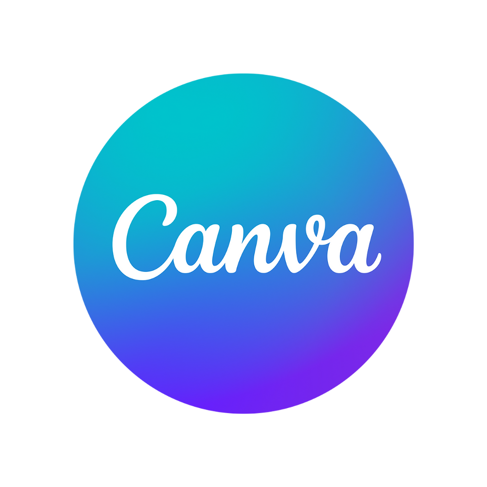

# Hi 👋, I'm Arulraj 

**AI & Data Science Student | Python Learner**

---

## 🚀 About Me
- 🎓 First-year **Artificial Intelligence & Data Science** Student at [KAHE](https://kahedu.edu.in/)
- 🌱 Currently learning **Python, Data Structures & Algorithms, HTML, CSS, MySQL**  
- 🧠 Actively solving problems on **LeetCode** to improve logic & problem-solving  
- 📄 HSLC Score: **83.3%**  
- 💡 Interested in **AI, Data Science, and Software Development**  
- 🎯 Goal: Build a strong foundation and grow into a skilled **AI & Data Professional**

---

## 🌐 Social Presence

  

  

  

---

## 🧑‍💻 I code in

  
  
  
  

---

## 🛠️ IDE and Tools I Use

  
  
  
  

---

## 📊 GitHub Contribution Activity

  

---

⭐ *Consistency, curiosity, and daily practice lead to success.*
